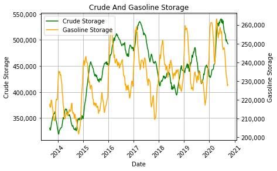

# Oil

# Project Overivew
* Identify factors that impact oil and prices.
* Determine if oil prices are in contango or backwardization.
* 

# Resources 
* Data Source: EIA Website
  https://www.eia.gov/petroleum/weekly/gasoline.php#tabs-gasoline-demand-finished
  
# Summary
* Crude storage and gasoline storage has been dropping steadily since Saudi Arabia sent a ton of ships to swamp the american market. We cannot tell what is happeing with floating offshore storage but since onland storage has been dropping and china has opened up its economy and has offloaded artificial floating storage.

* Gasoline storage has dropped approximately 30,000 Mbbls? Gasoline storage will need to decrease about 20,000 Mbbl for prices to pick back up
* Crude storage has dropped approximately 50,000 Mbbls? We need to drop another 100,000 Mbbls to reach prices of 60 to 70 dollars a bbl. Demand is expected to remain low due to covid but demand will likely decrease in the winter as less cars are on the road anyway bringing prices even lower than they were before. 
*Plus OPEC+ will decrease cuts and increase production as prices rise and will restrain prices for well into 2021.

*DUCs have risen steadily over the past two years and have started to increase since prices dropped in April. The majority of the DUCs in America are concentrated in the Permian. There has been a slight drop in the number of DUCs in the Permian due to historically low wells drilled. The eagle ford and the bakken have the next largest number of DUCS and have 

