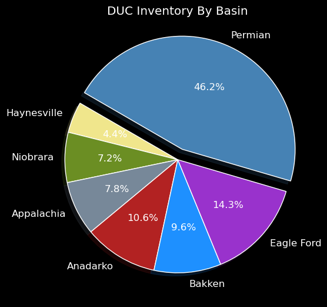

  

# Purpose
* Visualize key factors affecting prices in the oil and gas industry.
 

# Resources 
* Data Source: EIA Website 

  https://www.eia.gov/petroleum/weekly/gasoline.php#tabs-gasoline-demand-finished
 * ICIS Pipeline Info On Siberia 

https://www.icis.com/explore/resources/news/2020/04/30/10503185/gif-inside-story-power-of-siberia-2-s-new-route-makes-russian-gas-supplies-to-china-more-feasible
 
* China's Natural Gas Infrastructure  

https://www.reuters.com/article/us-china-naturalgas-pipeline/china-starts-building-southern-part-of-china-russia-east-gas-pipeline-idUSKCN24T0VU

* Export Capacity And Natural Gas Infrastructure 

https://oilprice.com/Energy/Crude-Oil/Asian-LNG-Prices-Are-Way-To-Low-For-US-Exporters.html

* Future Asian Consumption Of Natural Gas 

https://www.reuters.com/article/china-japan-lng/china-could-top-japans-lng-imports-in-2020-as-coronavirus-cuts-demand-idUSL4N2DT1I0

* China's Natural Gas Imports 

https://www.spglobal.com/platts/en/market-insights/latest-news/natural-gas/082620-china-data-july-lng-imports-rise-3-on-year-drop-13-on-month-to-5-mil-mt
  
* Offshore Storage Of Diesel 

https://www.reuters.com/article/us-asia-diesel-floating/traders-scout-for-supertankers-to-store-diesel-as-virus-spreads-idUSKBN27F1GQ
  

# Future Market Trends
Demand for crude oil declines in the winter after the summer driving season is over. This cyclical event is compounded with the return of Covid-19 and lockdowns impacting the futures market. WTI dropped $3 over a slight build in inventories which indicates that oil prices will be depressed throughout the winter. OPEC+ has indicated that they will continue to pare back cuts to approximately 5.8 MMBPD on January 1st which is unlikely considering that oil prices will likely fall further over the winter unless there is a supply disruption. The organization has flooded the market in 2018, 2019, and again in 2020 so there is no reason why the organization will not do it again in the spring of 2021 when prices begin to rise. 

The election is too close to call and it is unclear what will happen after the election. Even if President Trump wins re-election, Democrats can still prevent oil and gas from being extracted through state and local laws penalizing fracing or banning it outright. If Democrats win, they could drive up the price of oil by decreasing supply, returning the US to a major importer. The Democrats could also impact oil demand by banning gasoline powered vehicles throughout the US but it is unlikely that the amount of power generated through oil and gas will remain the same percenatage even after 2030. 

  
Natural gas demand will increase due to exports to Asia and the declining well count in the Appalachian and Barnet plays. Higher prices in the US will keep a lid on exports but China's growing consumption of natural gas and their rift with Australia will buoy exports. 

  
The price for WTI will average below $50/BBL for 2021 and will likely be below $45/BBL before the summer driving season depending on when OPEC+ will reduce supply cuts and the demand over the summer. Prices for gasoline, diesel, jet fuel and bunker fuel will be uneven. With the lockdown, gasoline will be in more demand than diesel and jet fuel which will require more storage until the summer. Refiners may not buy as much crude oil to refine into gasoline which means the diesel and jet fuel overhang may dimish but demand is uncertain in the spring of 2021. 

# Summary
## Crude And Natural Gas Storage
Crude storage peaked in 2020 as prices dipped below zero and bottomed out at -$40/BBL before rising up to $40/BBL. Inventories of both crude and gasoline have been dropping steadily but prices have traded within $2 for months.The lack of fluctuation in prices even with falling crude storage means that traders have been reluctant to take risks in the market. The costs of VLCCs has been stuck below $40,000 per day making it a cheaper alternative to some onshore storage sights but demand for offshore storage of diesel has been heating up. Floating storage in the US and China has likely dropped due to the available storage on land in America and China now allowing VLCCs to offload their cargo even in the face of the Covid-19 outbreak. 

  

The graph above shows the relationship crude oil and gasoline have with WTI prices. Prices have been stuck near $40/BBL since prices bounced back after the April crash. For more information on crude storage vist my link below.

  
 
   ***[Price Impacts From Cude Storage](https://www.linkedin.com/pulse/price-impacts-from-crude-storage-shawn-jamal/?trackingId=a%2FoH27YmqkNMbJIrQEBHQQ%3D%3D)***

Crude storage has decline 50 MMBBLs and gasoline storage has declined 30 MMBBLs since April of 2020. While inventories have steadily declined, the price of crude has stagnated at $40/BBL. Crude will need to drop another 100 MMBBLs for prices to rise to the $60 to $70 range and at this time OPEC+ will likely increase supply to balance the market in 2021. Gasoline storage will drop until November when demand goes down and refiners begin to buy more crude.

  

Demand for crude is expected to remain low in the winter after the summer driving months are over. Demand for natural gas rises in the winter due to the need for heating. From 2016 to 2017 and 2017 to 2018, crude storage and gasoline has dropped as the year went on only to rise in the winter when demand dropped off. In 2018, 2019 and 2020 OPEC+ have flooded the market in the winter putting a lid on prices to prevent shale drillers from ramping up production. 

Due to recent exports of natural gas, a decrease of drilling in the Appalachian region, and current political trends impacting the drilling in Wyoming, it is expected that natural gas prices will begin to rise in the winter.

  

The graph above shows how natural gas exports have risen over the years. Korea, China, and Japan are the biggest natural gas imports for the US. China has refrained from buying vast amounts of natural gas due to trade conflicts with the US and Turkey has been drilling on their coastal boarder with Greece trying to develop gas fields in the Mediteranian. China has begun to allow more natural gas imports into the country and for an indepth look at their future market visit the link below. 

  
  ***[China's Natural Gas Imports](https://www.linkedin.com/pulse/chinas-natural-gas-imports-shawn-jamal/?trackingId=li0Zy0L7swttzD33jILFDw%3D%3D)***

OPEC+ will continue to curb supply until 2021 when they will see prices begin to rise. If prices rise, the organization will likely reduce cuts and flood the market like they have done in 2018, 2019, and 2020. The organization has indicated that it release more crude oil on January 1st but this is unlikely due to low prices. They will likely reduce cuts to approximately 6MMBPD in the spring as crude prices begin to rise.

  

The graph above shows how crude storage has impacted price over several years. In most years, crude storage peaks at the beginning of the year when demand is low and begins to decline in March as refiners buy more crude to refine into gasoline. This continues until the summer driving season is over when crude stocks begin to rise in October. This year crude storage peaked in the middle of the year and has declined until the end of the year. Prices dropped $3 per barrel after a modest rise of crude storage before recovering to approximately $40/BBL. If this is any indication of future market trends then we will see a downward pressure on prices after the winter due to growing crude supplies.

The number of DUCs have risen exponentially over the past two years but decreasing at the end of 2019 as prices were expected to rise. The majority of DUCs are in the Permian Basin and can be quickly completed to make up for any lost production as prices rise. DUCs can also provide much needed cash flow for companies due to the drilling already being completed.

  

The pie chart above shows the percent of DUCs in each region in the US. The Permian Basin has the lion's share of DUCs with the Eagle Ford and the Bakken making up the next biggest shale plays.

  

The number of DUCs in the Permian took off in 2015 as prices dropped from historic highs and has remained constant in the next big shale plays. If history is any indication then DUCs will continue to rise until prices begin to climb. One thing that will keep a lid on the number of DUCs around the country is that oil companies do not have as many long term contracts with drilling companies allowing them to break current contracts and drop rigs. This is one of the reason why the rig count has hit historic lows around the country. For more on DUCs visit my link below.

  
  ***[Election Impact On The DUC Inventory In America](https://www.linkedin.com/pulse/election-impact-duc-inventory-shawn-jamal/?trackingId=MJYml0qeR%2F%2Bt0hue99YQsg%3D%3D)***

