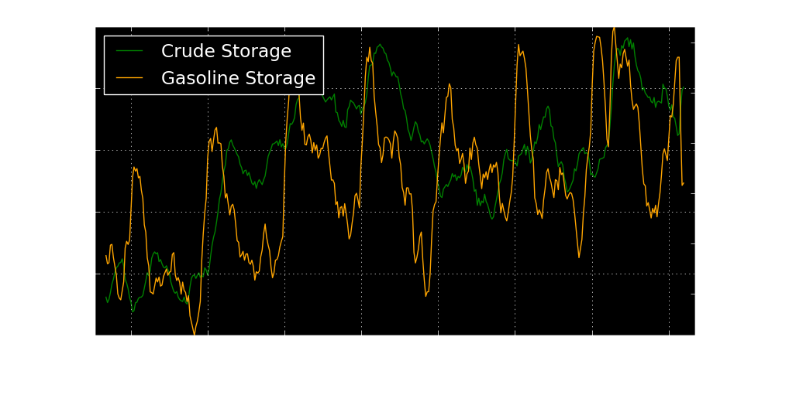
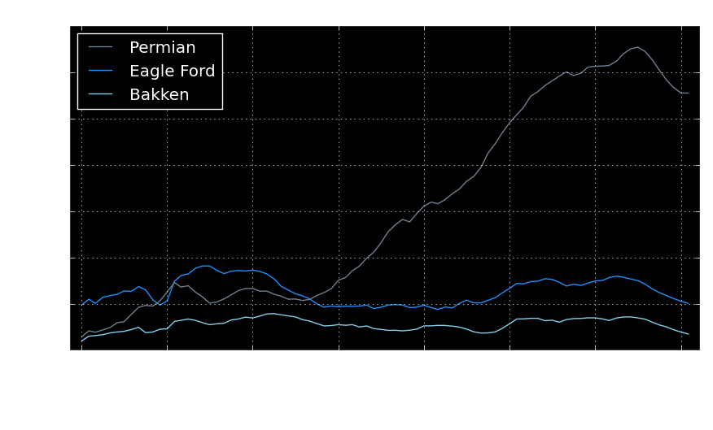

# Project Overivew
* Visualize key factors in the oil and gas industry.
 

# Resources 
* Data Source: EIA Website 

  https://www.eia.gov/petroleum/weekly/gasoline.php#tabs-gasoline-demand-finished
  
# Summary
* Crude storage peaked in 2020 as prices dipped below zero and bottomed out at -$40/BBL before rising up to $40/BBL. Inventories of both crude and gasoline have been dropping steadily but prices have traded within $2 for months. Floating storage in the US and China has likely dropped due to the available storage on land in America and with China opening its ports after the virus allowing shippers to unload their VLCCs. Even though storage has been dropping steadily, traders have not allowed the price to flucuate more than $2 a barrel in months.

The graph above shows how crude and gasoline stocks fall while prices remaining at $40/BBL.

* Crude storage has decline 50 MMBBLs and gasoline storage has declined 30 MMBBLs since April of 2020. While inventories have steadily declined, the price of crude has staggnated at $40/BBL and have remained steady. Crude will need to drop another 100 MMBBLs for prices to rise to the $60 to $70 range and at this time OPEC+ will likely increase supply to balance the market. Gasoline storage will drop until November when demand goes down and refiners begin to buy more crude.

* Demand for crude is expected to remain low in the winter after the summer driving months are over. Demand for natural gas rises in the winter due to the need for heating. Due to recent exports of natural gas, a decrease in the Appalachia region, and current political problems impacting the drilling in Wyoming, it is expected that natural gas prices will begin to rise in the winter.

The graph above shows how natural gas exports have risen over the years. Korea, China, and Japan are the biggest natural gas imports for the US.

* OPEC+ will continue to curb supply until 2021 when they will see prices begin to rise. If prices rise, the organization will likely reduce cuts and flood the market like they have done in 2018, 2019, and 2020. 

The graph above shows how crude and gasoline storage ebb and flow over different years. In most years, crude storage peaks at the beginning of the year when demand is low and begins to decline in March as refiners buy more crude to refine into gasoline. This continues until the summer driving season is over when crude stocks begin to rise in October.

* The number of DUCs have risen exponentially over the past two years. There was a decrease in the number of DUCs at the end of 2019 continuing into 2020. The majority of DUCs are in the Permian Basin and can be quickly completed to make up for any lost production assuming prices rise again. This will also keep a lid on prices and provide companies with much needed cash flow.

The pie chart above shows the percent of DUCs in each region in the US.

The graph above shows how the number of DUCs has risen in the Permian Basin vs the next two biggest basins.

